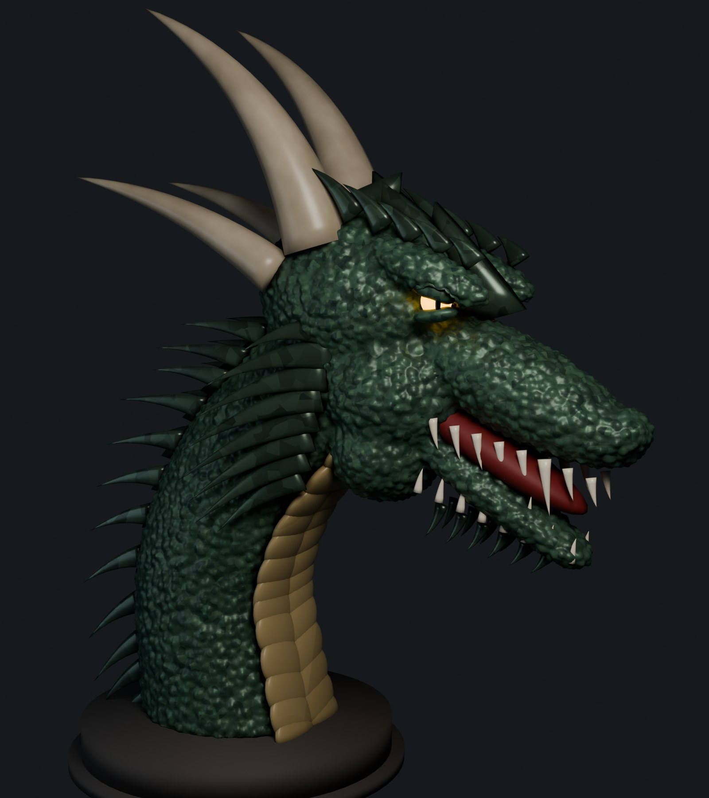
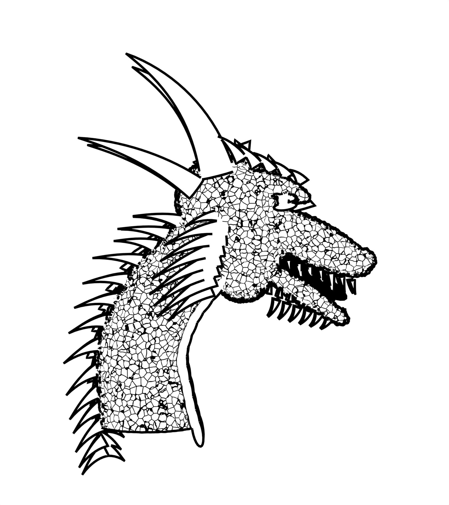

# Dragon head bust

A procedurally built 3D bust of a snarling dragon's head on an S-curved neck. It is
interpreted from a black-and-white illustration and rendered two ways: in colour, and as a
black-and-white ink drawing in the style of the original.

| Colour, three-quarter view | Ink, profile |
|---|---|
|  |  |

## Credit

Based on [Detailed stylized illustration of a fearsome dragon's head](https://www.vecteezy.com/vector-art/73442379)
by **Promm Design**, from [Vecteezy](https://www.vecteezy.com), used under the Vecteezy Free
License (attribution required). The original illustration is not included in this repository.

## Usage

Run from any directory; output is written next to the script.

```sh
# build dragon.blend and render dragon.png and dragon_ink.png (~3 min on CPU)
blender --background --python build_dragon.py -- --render

# quick low-quality preview renders while editing (~20 s)
blender --background --python build_dragon.py -- --preview

# build dragon.blend only
blender --background --python build_dragon.py
```

The README images in `images/` are compressed copies of the two renders.

## How it is built

- **Head and neck:** overlapping ellipsoids (cranium, cheeks, snout, nose, jaw, brow) and a
  tube swept along an S-curve for the neck are fused into one surface with a voxel remesh, then
  smoothed. The eye sockets are cut with booleans, and the base is cut flat to stand on a round
  plinth.
- **Scales:** real relief, not just a texture. A Voronoi displacement presses a groove around
  every scale cell. The skin shader varies colour per cell and darkens the crevices.
- **Horns, spikes and plates:** tapered tubes swept along curves. Flattening the cross-section
  turns a horn into a blade, which is how the crest, the swept-back frill behind the jaw, the
  neck mane, the brow plates and the chin spikes are made.
- **Throat:** chevron belly plates, each made of two overlapping wings set in a V.
- **Face:** two rows of teeth in a dark mouth, glowing slit-pupil eyes under heavy lids slanted
  into a scowl.
- **Ink render:** every material is swapped for white "paper". Scale cells are outlined in
  black with a Voronoi distance-to-edge shader, deep crevices fill with solid black, and
  Freestyle draws the silhouette lines.
