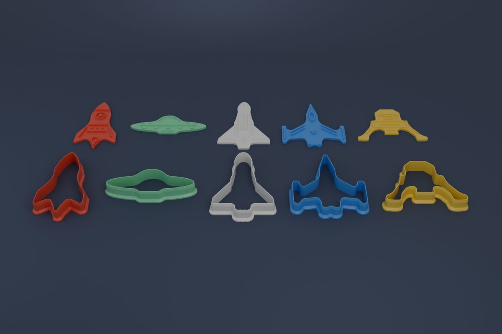
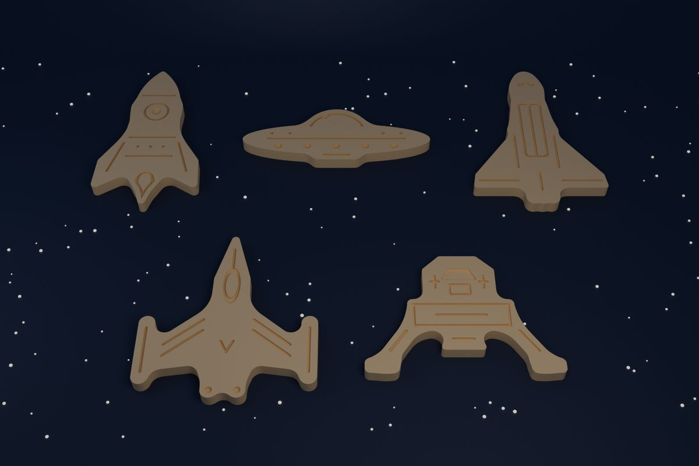

# Space cookie cutters

Five spaceship cookie cutters: a retro rocket, a flying saucer, a space shuttle, a
starfighter and a moon lander. Each one comes as a pair:

- **Cutter**: a single wall that follows the silhouette. It has a sharp single-bevel blade
  and a wide chamfered foot that you press on. It has no inner pieces, so there are no ribs
  to drag through the dough.
- **Stamp**: a plate just smaller than the cookie, with raised detail on it. After cutting,
  press it into the cookie to emboss portholes, panel lines, flames, canopies and windows.





## Usage

Run from any directory; output is written next to the script. One Blender unit is one
millimetre, and the STL files are in millimetres too.

```sh
# build space_cutters.blend, write stl/*.stl, check everything
blender --background --python build_space_cutters.py -- --check

# also render cutters.png and cookies.png (Cycles)
blender --background --python build_space_cutters.py -- --render

# quick Workbench versions of both pictures
blender --background --python build_space_cutters.py -- --preview

# close-ups of every cutter and a top view of every stamp, for inspection
blender --background --python build_space_cutters.py -- --closeups

# build only some ships while iterating on a drawing
blender --background --python build_space_cutters.py -- --check --only rocket,lander
```

`--check` exits with an error if any check below fails. The images above are compressed
copies of `cutters.png` and `cookies.png`.

## Output

| File | Contents | Size (mm) |
|---|---|---|
| `stl/rocket_cutter.stl` / `rocket_stamp.stl` | retro rocket | 65 × 109 × 16 / 55 × 99 × 5 |
| `stl/saucer_cutter.stl` / `saucer_stamp.stl` | flying saucer | 112 × 46 × 16 / 102 × 36 × 5 |
| `stl/shuttle_cutter.stl` / `shuttle_stamp.stl` | space shuttle, seen from above | 80 × 109 × 16 / 70 × 99 × 5 |
| `stl/starfighter_cutter.stl` / `starfighter_stamp.stl` | starfighter | 94 × 100 × 16 / 84 × 90 × 5 |
| `stl/lander_cutter.stl` / `lander_stamp.stl` | moon lander | 102 × 75 × 16 / 92 × 65 × 5 |
| `space_cutters.blend` | all ten parts | |
| `cutters.png`, `cookies.png` | renders, 1800 × 1200 | |

The STLs are committed, so you can print them without Blender. Each one is centred and sits on
the bed in the orientation it prints in.

## Printing

- **Cutters** print foot-down, blade up. **Stamps** print plate-down, ridges up. Neither needs
  supports, and the foot's 45° chamfer has no overhang.
- Use a 0.4 mm nozzle with 0.2 mm layers. The wall is 1.6 mm (four perimeters) and the blade
  tapers to 0.8 mm (two). The ridges are 1.4 mm wide and 2 mm tall.
- Every part fits a 256 mm bed. A cutter and its stamp fit on one plate together.
- PLA is the usual material. A printed part is not a certified food-contact surface: wash it
  in warm water (no dishwasher), or use food-safe PETG.

To use them, roll the dough to about 6–8 mm and cut. Then lightly flour the stamp and press it
straight down about 1.5 mm into the cut cookie. The stamp's plate is 1 mm inside the cookie
line all round, so it drops into the cutter if you stamp before lifting the cutter away.
The detail is mirrored on the stamp, so it reads the right way round on the cookie.

## How it is built

**Silhouettes as distance fields.** Each ship is drawn as a 2D signed distance field: rounded
boxes, capsules, circles and convex polygons, joined with a smooth minimum. The cookie line
is the zero contour, traced with marching squares.

**Rounding by construction.** The foot sticks out 4 mm, so any inside corner tighter than
that would fold the foot back through the wall. The stamp plate sits 1 mm inside, so any tip
sharper than that would fold the plate. The outline is therefore *closed* (every inside corner
gets a radius of at least 4.8 mm) and then *opened* (every tip gets at least 1.6 mm). Both are
exact offsets of a distance field, computed against a densely sampled loop with a KD-tree.

**No booleans.** The cutter is one loft. The inner face is vertical on the cookie line, so the
cookie is exactly the drawn shape. The outer face steps through foot, chamfer, wall and blade
bevel. The stamp and the rendered cookie use the same relief builder: a slab, the detail
walls, and top faces filled by a constrained Delaunay triangulation of every outline. A
triangle is kept if its centre lies inside an odd number of outlines, so islands and rings
both come out right. Every surface shares its edges, so each part is watertight by
construction, and the checks confirm it.

**Detail.** Panel lines are strokes along polylines. Portholes and canopies are rings around
a shape, and the border lines follow the exact distance to the cookie line. All detail is
clipped 1.2 mm inside the plate edge.

## Checks

Every build runs these, and `--check` makes them fatal:

- The silhouette is one piece, and no part of the cookie is under 5 mm wide for more than a
  rounded tip's worth of dough. This is a morphological opening of the cookie; anything it
  removes is a part that would snap.
- The foot and the stamp plate never fold through themselves. Every ring point keeps its
  offset from the cookie line.
- Every ridge is printable: about 1.4 mm wide (within the 0.2 mm check grid), and no detail sliver is under 1.2 mm².
- The cutter, stamp and rendered cookie are each one closed, manifold piece with no
  self-intersecting faces, the right height, and sitting on z = 0.
- The stamp, flipped over the way you press it, lies at least 1 mm inside the cookie line
  everywhere, and is smaller than its cookie.
